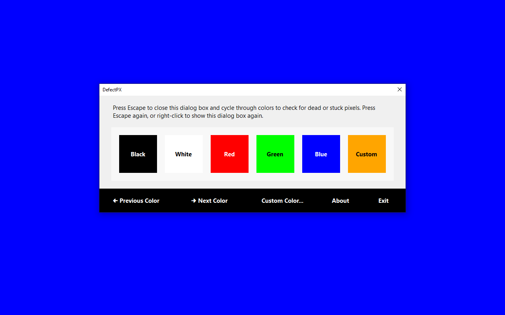

# DefectPX
DefectPX allows you to easily check for dead, stuck, or defective pixels.

Just change a few colors and test. Test monitors before purchasing. Test screens during the warranty period. Test anytime and anywhere.

DefectPX comes with both mouse and keyboard shortcuts, multi-monitor support, and a very intuitive interface. Free and open-source, portable, no installation required!

## Screenshot

## Quotes

> "DefectPX permits straightforward dead, defective, or stuck pixel detection. … The interface is simple and intuitive, making it of use to any user who wants to ensure their LCD monitor is up to snuff." (MajorGeeks)

> "Save both money and time by taking advantage of this lightweight application capable to detect dead or stuck pixels on LCD monitors" (Softpedia)

> "This small tool is completely portable and does not require any installation, so just run the program; optionally you can also download the installer which lets you install this program like any other software." (Technix Update)

[More Reviews](https://www.appliberated.com/defectpx/reviews/)

## Download

The latest stable version of DefectPX can be downloaded from [Appliberated](https://www.appliberated.com/defectpx/download/) or [GitHub Releases](https://github.com/appliberated/DefectPX/releases). You can download the Installable Version, or the Portable Version that does not require installation. DefectPX runs on Windows 10, 8.1, and 7 SP1. It requires the .NET 5.0 Runtime (which is also free and open-source). DefectPX will let you download and install it, if it's not already installed on your PC.

## Source Code

DefectPX is written in C# using Windows Forms and .NET 5.0. The project is developed using Visual Studio Community 2019, with the help of [StyleCop.Analyzers](https://github.com/DotNetAnalyzers/StyleCopAnalyzers).

## Contributions

All contributions are welcome: use-cases, documentation, design, graphics, icons, code, patches, bug reports, feature requests, suggestions, etc. You do not need to be a programmer to speak up! Also, if you like DefectPX, give it a star on GitHub! ⭐️

## License

DefectPX is licensed under the [MIT License](LICENSE).
